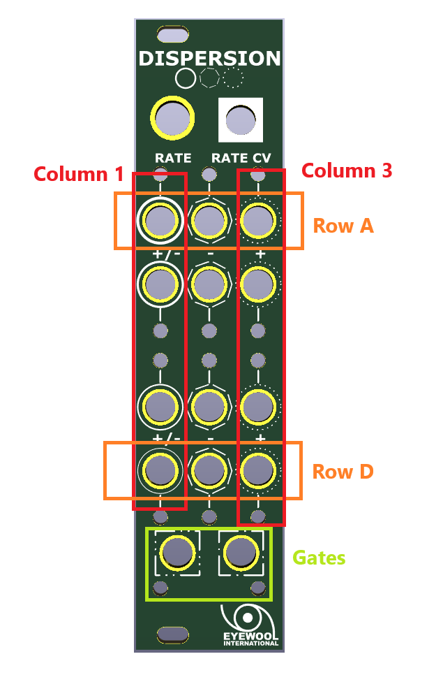

# Dispersion Modulator
- HW Revision as of 01.27.25
- Processor: 2.0
- I/O Board: 2.0
- Panel: 2.0 

## Module Interface Description: 

Dispersion creates 12 slow modulation waves and 2 gates to inject almost predictable and slightly controllable slow variation into your patch. All outputs are derived from hardware recombination of four digitally-generated LFOs. There is a single speed control which collectively adjusts the speed of all four of the module's base LFO rates. 
### CV Outputs
It is helpful to think of 12 CV outputs in three columns, 1 through 3, and four rows, A through D. 

Column 1 outputs provide four bi-polar (+/-8V) LFOs that sit between a triangle and sine shape. Their relative rates go from slowest to fastest  as you go toward the bottom of the module--slowest on top, fastest on bottom. 

The remaining two columns provide difference rectified combinations of the four original waves. These outputs are sometimes spiky, sometimes smooth, and often very nearly but not quite repetitive. 

The center column provides negative polarity outputs (-8V peak), the far right column provides positive polarity outputs (+8V peak). While each of these outputs are influenced by all four base waves, outputs are most influenced by the base wave with which they share a row. The top-most slowest wave influences the top most center and right side difference rectifier output, and so on. 

### Gate Outputs
The two bottom jacks on the module (those with square symbols around them), provide 0V-8V gates. These gates are based two internal comparator circuits which compare the values of the four base LFOs to generate arrhythmic gate patterns which can be used to trigger other events in a patch, such as envelopes or sequential switches. 

### CV Input
There is one CV input to control the overall relative speed of the four base LFOs. It will accept a bi-polar control voltage from -10V to +10V. With nothing patched into the CV jack, the knob will control the speed of the system. With a CV patched into the jack, the knob becomes an attenuverter for the CV that's been applied. 

## Module Functional Description: 
Every time power is applied to the module, it will briefly perform some internal randomization calculations. These calculations define the starting phase of each base LFO as well as a fixed frequency multiplier per LFO that is applied to all rate calculations. Each base LFO will always remain roughly within a fixed frequency range relative to the CV speed control, but they will vary every power cycle slightly. 

Below is a table of the rough cycle time you can expect from each base LFO. This time can vary as much as 25% for each individual output based on the results of the random calculations. 

| Output | Slowest Cycle | Fastest Cycle |
| ------ | ------------- | ------------- |
| A      | 30 minutes    | 4 minutes     |
| B      | 15 minutes    | 2 minutes     |
| C      | 5 minutes     | 45 seconds    |
| D      | 2 minutes     | 15 seconds    |

## Power Requirements
- 100ma Draw from +12
- 80mA draw from -12
- Power header is reversible, you may plug in either orientation and it will power the module without any risk of damage
