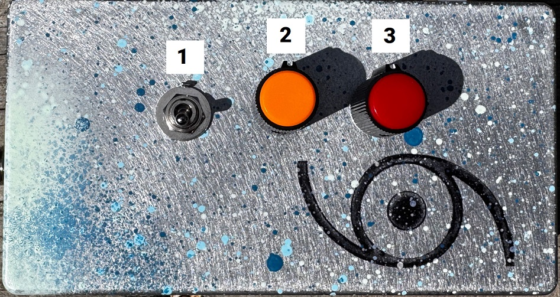

# Ampersand
- HW Revision 1.0
- Power: 9V Center Negative (pedal power), <50mA current 
- Price: $75

## Description 
The Eyewool International Ampersand is an active feedback loop tool. It allows for easy no-input configurations with almost any audio processing device(s) via its Send/Return loop. It allows additional shaping of the no-input sounds via a phase inversion toggle, a simple tilt EQ, and a feedback path attenuator. 

The Ampersand won't do much on its own, but in conjunction with other pedals and effects, it can turn almost anything into complex oscillator. 

## Controls
A labelled image of the control surface of the device is below. 

1. This is a phase inversion toggle, it flips the phase of the signal before it hits the Ampersand's internal circuitry. The effect of this toggle will change based on what you have in the feedback loop, sometimes jumping between two "notes," other times shifting subtly, and still other times shutting off the noise entirely in one position due to phase cancellation in the loop. 
2. This is a tilt EQ place inside the device's feedback loop. While its circuitry is similar to standard guitar pedal tone controls (e.g. Big Muff, Rat), because the circuit is in the feedback loop it will often more like a pitch control. 
3. This is an attenuator control, once again in the feedback path. It controls how much of signal from the return jack makes it through the internal circuit and out to the send jack. Most of the time it won't really work like a volume knob, but if you turn it all the way counter-clockwise, it should turn off your output signal. 

## I/O
In addition to the power jack, the sides of the device have three 1/4" audio jacks which are detailed below: 

- S(end) - route this to the input of your external audio device
- R(eturn) - route the output of your external audio device back to this jack
- & - this is the audio output jack. Fair warning, like with most no-input setups, the output here is almost always very loud, so start with the system volume low. Putting a fuzz, distortion, or a compressor here is a good way to limit the output volume and add some extra texture to the signal. 